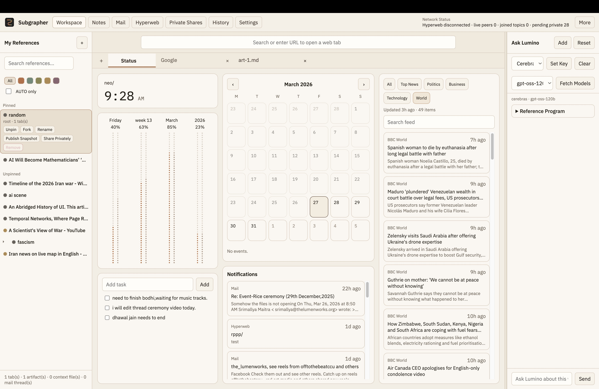
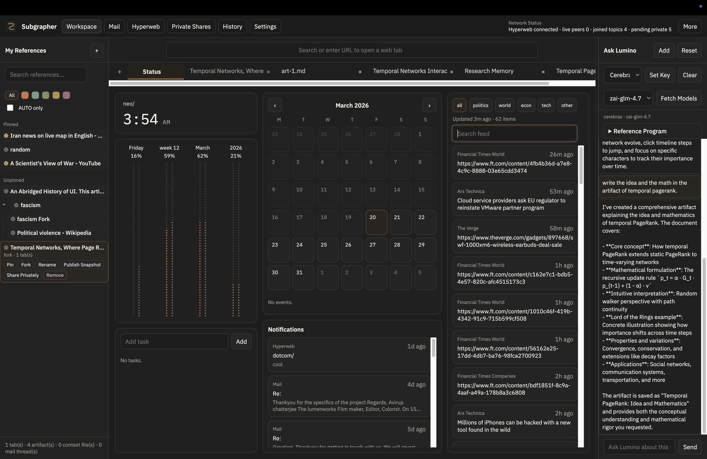
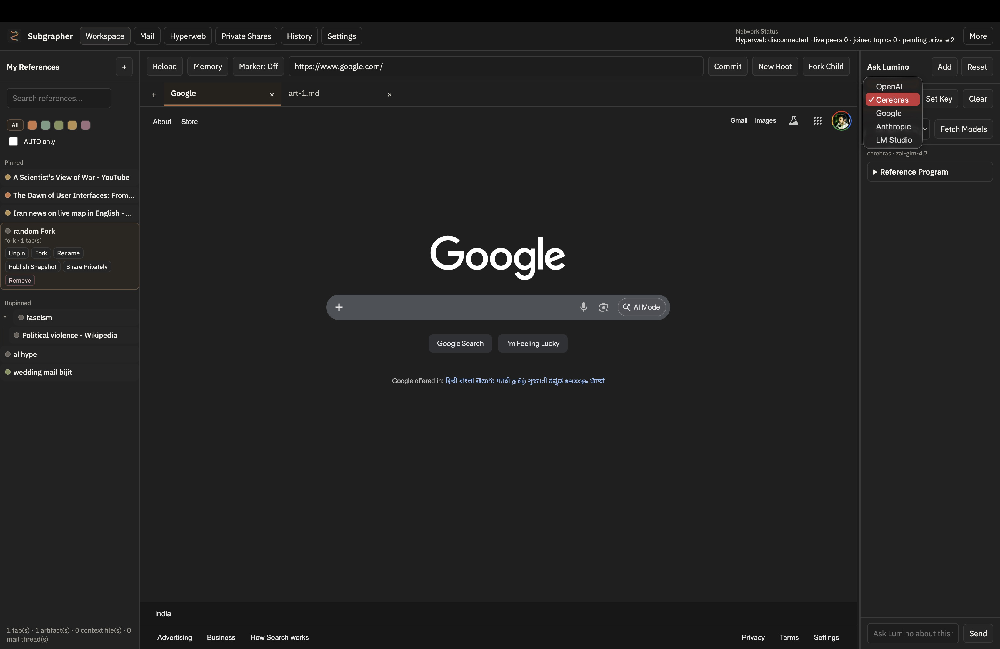
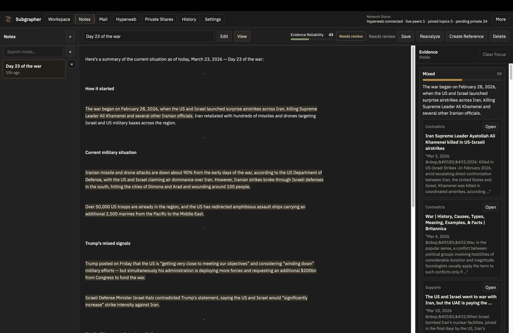
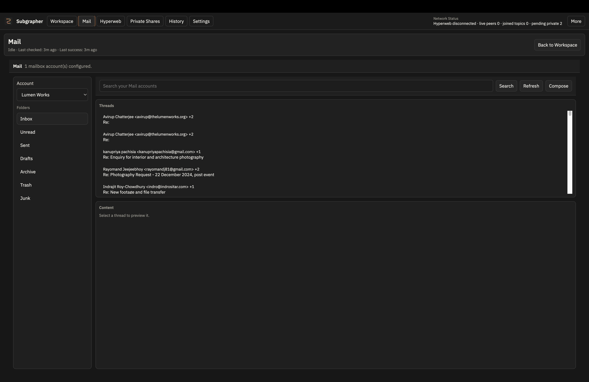
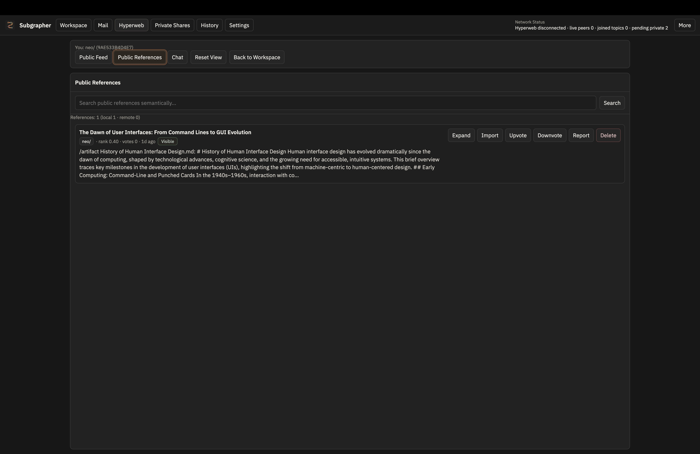
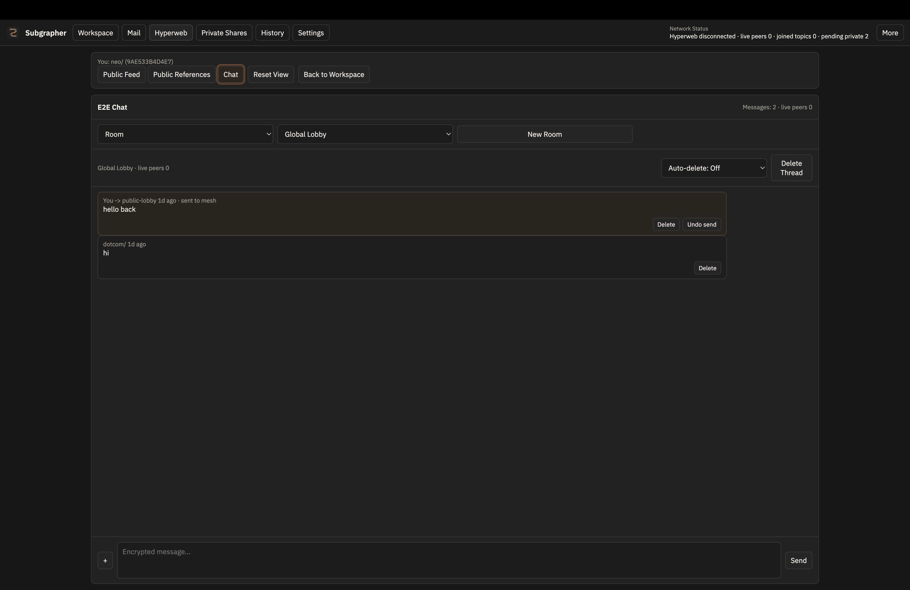
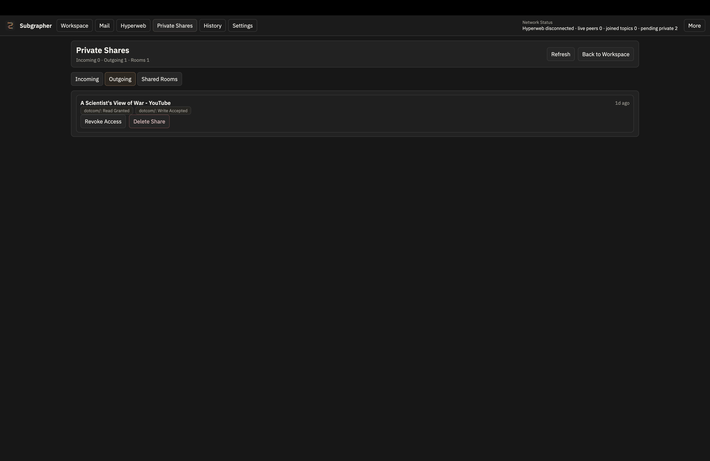

# Subgrapher

Subgrapher is a desktop app for building, browsing, and sharing knowledge as semantic references.

A semantic reference is the core unit in the app. Inside a reference you can browse the web, write notes, attach folders, attach mail threads, generate HTML visualizations, and let an AI agent reason over that context. References can be forked, shared publicly, or shared privately with trusted peers.

Subgrapher also includes a dedicated Notes surface for ambient evidence-aware drafting. Notes are thought-first writing spaces where claims are identified in the background, web evidence is retrieved automatically, local regions are scored, and the note can later be promoted into Workspace with its evidence context preserved.

Subgrapher also works as:

- a local-first AI workspace
- a mail client
- a personal organizer for time and events
- a decentralized knowledge and message sharing platform
- a remote interface for reasoning over your work through Telegram with local models

The project exists because I wanted a better way to share research with other people. It is open source and still in progress.

## Why

Human knowledge usually lives in semantic containers, not in flat lists of links or isolated files.

Most software keeps knowledge trapped in separate apps, inboxes, and private silos. Most sharing tools also depend on centralized servers.

Subgrapher is an attempt to build for the open web and open communication instead: a system where references, research, messages, and agents can move across those walls without defaulting to closed platforms.

## What it does

- Uses semantic references as reusable knowledge containers
- Includes ambient Notes that detect factual claims, gather web evidence, score reliability, and carry evidence forward into Workspace promotion
- Downloads the bundled local LLM runtime and GGUF model on first launch, then uses it for note policy routing and Status feed cleanup
- Lets the agent reason inside a reference and open tabs or generate visualizations for you
- Supports local models through LM Studio in a sandboxed setup
- Supports API models from OpenAI, Google, Anthropic, and Cerebras
- Uses DuckDuckGo for privacy-focused web search
- Includes a marker tool for capturing and working with web content inside references
- Attaches folders, local files, and mail threads to the same working context
- Keeps semantic history so past browsing and research can be searched and revisited
- Includes a Status tab with time progress, quick tasks, a calendar, notifications, and a topic feed
- Lets you retry broken feed stories with a full `refetch -> LLM cleanup -> summary regenerate` flow
- Supports private peer sharing and public publishing
- Connects a Telegram bot so you can use your local models remotely

## Links

- Source: [github.com/srimallya/subgrapher](https://github.com/srimallya/subgrapher)
- Demo: [youtu.be/l4z1ddCcjEQ](https://youtu.be/l4z1ddCcjEQ?si=r8v6ysC6w99PYNu7)
- Download: [thetrustcommons.com/apps](https://thetrustcommons.com/apps)

## Screenshots











## Run locally

```bash
npm install
npm start
```

## Light mode

Subgrapher has a persisted `dark` / `light` theme toggle on the top-left `Subgrapher` brand control.

Light mode is meant to cover the app's first-party chrome, not just swap the background behind dark panels. Current light-mode work includes:

- top bar, workspace rails, tabs, and browser chrome
- Status, Settings, History, Mail, Hyperweb, and modal shells
- artifact header, editor shell, markdown preview shell, and related controls

The goal is a calm warm-light UI with readable contrast, not a glossy white SaaS theme. Embedded/source-driven content may still keep its own darker presentation when that content is actually code or preview material, but surrounding chrome should follow the active theme.

## Build

```bash
npm run build:mac
npm run build:win
npm run build:release
```

Build output goes to `dist/`.

On installed builds, the bundled small-LLM runtime is bootstrapped on first launch into app-managed local data. After the download finishes, Subgrapher automatically processes pending note analysis and Status feed cleanup tasks.

## Current stack

- Electron desktop app
- Model providers: OpenAI, Google, Anthropic, Cerebras, and LM Studio
- Hyperswarm-based sharing primitives
- Local mail storage and sync

## License

AGPL-3.0-or-later. See `LICENSE`.
