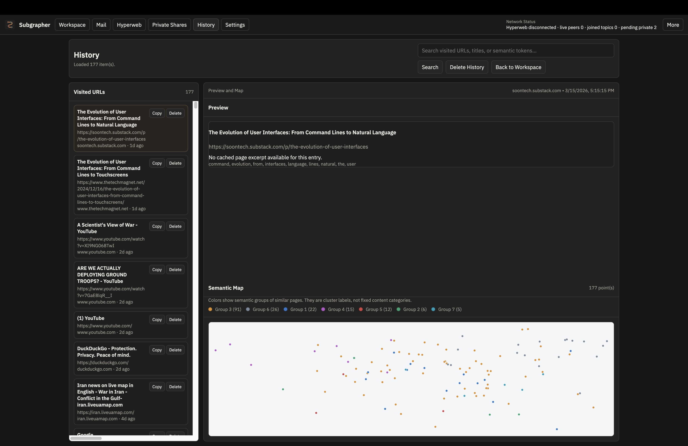
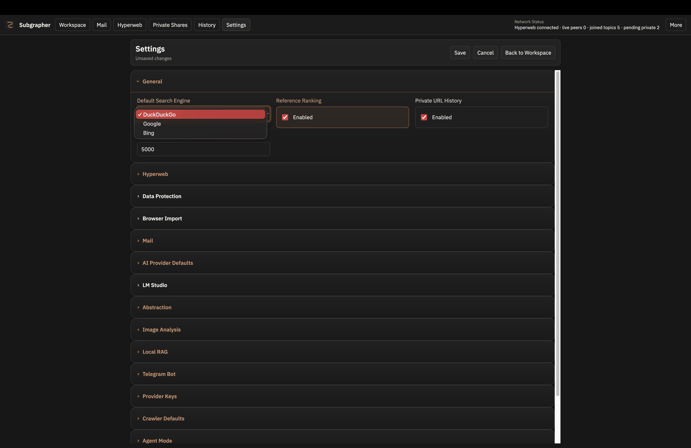

# Subgrapher

Subgrapher is a desktop app for building, browsing, and sharing knowledge as semantic references.

A semantic reference is the core unit in the app. Inside a reference you can browse the web, write notes, attach folders, attach mail threads, generate HTML visualizations, and let an AI agent reason over that context. References can be forked, shared publicly, or shared privately with trusted peers.

Subgrapher also works as:

- a local-first AI workspace
- a mail client
- a decentralized knowledge and message sharing platform
- a remote interface for reasoning over your work through Telegram with local models

The project exists because I wanted a better way to share research with other people. It is open source and still in progress.

## What it does

- Uses semantic references as reusable knowledge containers
- Lets the agent reason inside a reference and open tabs or generate visualizations for you
- Supports local models through LM Studio in a sandboxed setup
- Uses DuckDuckGo for privacy-focused web search
- Attaches folders, local files, and mail threads to the same working context
- Supports private peer sharing and public publishing
- Connects a Telegram bot so you can use your local models remotely

## Links

- Source: [github.com/srimallya/subgrapher](https://github.com/srimallya/subgrapher)
- Demo: [youtu.be/l4z1ddCcjEQ](https://youtu.be/l4z1ddCcjEQ?si=r8v6ysC6w99PYNu7)
- Download: [thetrustcommons.com/apps](https://thetrustcommons.com/apps)

## Screenshots





## Run locally

```bash
npm install
npm start
```

## Build

```bash
npm run build:mac
npm run build:win
npm run build:release
```

Build output goes to `dist/`.

## Current stack

- Electron desktop app
- Local and remote model provider support, including LM Studio
- Hyperswarm-based sharing primitives
- Local mail storage and sync

## License

AGPL-3.0-or-later. See `LICENSE`.
